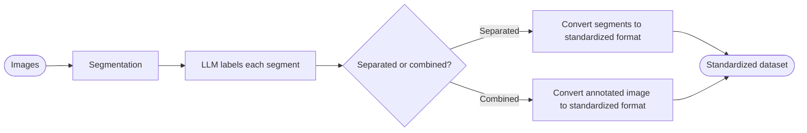

# adagen

Automatic image dataset generation and labeling with CV segmentation and LLMs.

## Pipeline

## Tech Stack

- C++ with OpenCV for segmentation and final dataset generation
- Python with OpenAI SDK for labeling
